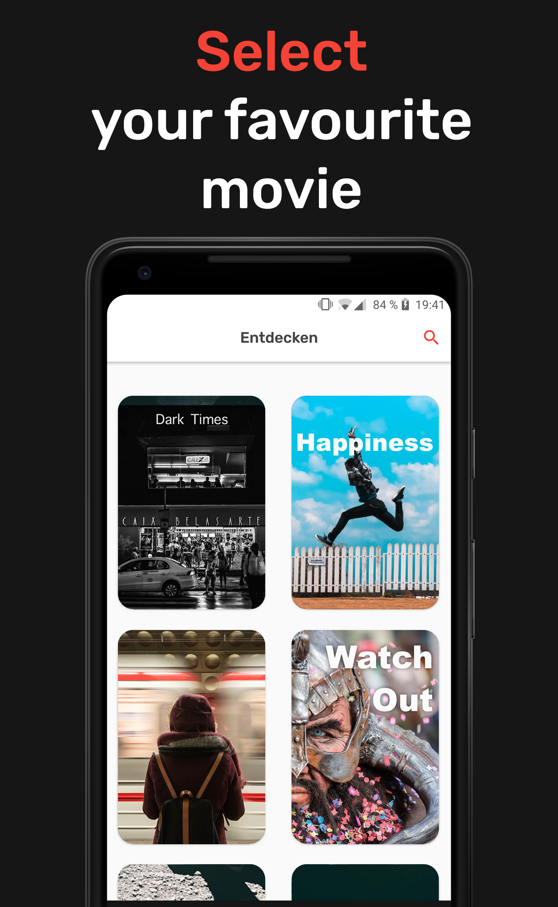

# Movies-with-Kotlin

Some facts about this project:
- completly written in Kotlin
- uses MVVM-Pattern
- is an instant app
- dependency injection with dagger
- Android ViewModels
- Network layer with Retrofit and RxJava

## The App

Movies with Kotlin is an Open Source Android Application, that is focused on movie recommendations.
The basic principle is: Discover new movies based on movies you already know.

The App has 3 Screens.
On the first screen the user can search and select a movie he already knows.
On the second screen the user can browse recommended movies similar to the selected movie.
On the third screen the user can browse movie details to a selected movie.